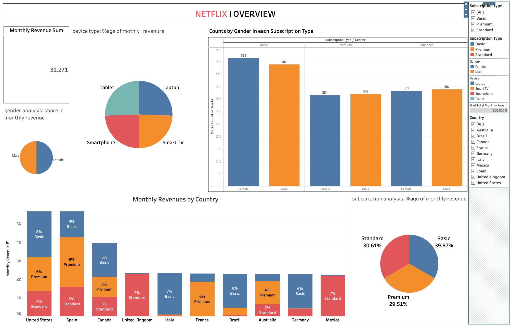

# 📊 Netflix Subscription Analytics Dashboard (Tableau)

A professional **Tableau dashboard project** analyzing Netflix subscription data across **countries, devices, genders, and subscription tiers**.  
This project demonstrates strong skills in **data visualization, business analysis, and dashboard storytelling** using Tableau.

---

## 🔍 Project Overview

The dashboard provides insights into:

- **Total Monthly Revenue**
- **Revenue distribution by Country**
- **Subscription Type analysis (Basic, Premium, Standard)**
- **Gender-wise subscription counts**
- **Device usage patterns**
- **Revenue contribution percentages**

The goal is to help stakeholders quickly understand **customer behavior and revenue drivers**.

---

## 🧩 Dashboard Highlights

### 1. Monthly Revenue Summary
- Displays overall monthly revenue across all selected filters.

### 2. Revenue by Country
- Country-wise stacked bar chart showing revenue split by subscription type.

### 3. Subscription Type Distribution
- Pie chart showing % contribution of **Basic, Premium, and Standard** plans.

### 4. Gender Analysis
- Gender-wise count of users across different subscription types.

### 5. Device Usage Analysis
- Subscription usage across **Laptop, Smartphone, Smart TV, and Tablet**.

---

## 🛠️ Tools & Technologies

- **Tableau Desktop**
- **Data Visualization & Dashboard Design**
- **Business Analytics**
- **GitHub for version control**

---

## 📁 Recommended Project Structure

```text
Netflix-Tableau-Dashboard/
│
├── data/
│   └── netflix_subscription_data.csv
│
├── dashboard/
│   └── Netflix_Dashboard.twbx
│
├── images/
│   ├── dashboard_overview.png
│   └── dashboard_detailed.png
│
├── README.md
└── LICENSE
```

---

## 🖼️ Dashboard Preview




---

## 🚀 How to Use

1. Download the `.twbx` file from the `dashboard/` folder
2. Open it using **Tableau Desktop**
3. Use filters (Country, Subscription Type, Device) to explore insights

---

## 📌 Key Learnings

- Designing business-friendly dashboards
- Creating clear KPI-focused layouts
- Using Tableau filters & calculated fields effectively
- Presenting insights with minimal visual clutter

---

## 👤 Author

**Bipranshu Baghel**  
Aspiring Data Analyst | Finance & Analytics Enthusiast  

---

## ⭐ If you like this project

Consider giving the repository a **star ⭐** — it really helps!
